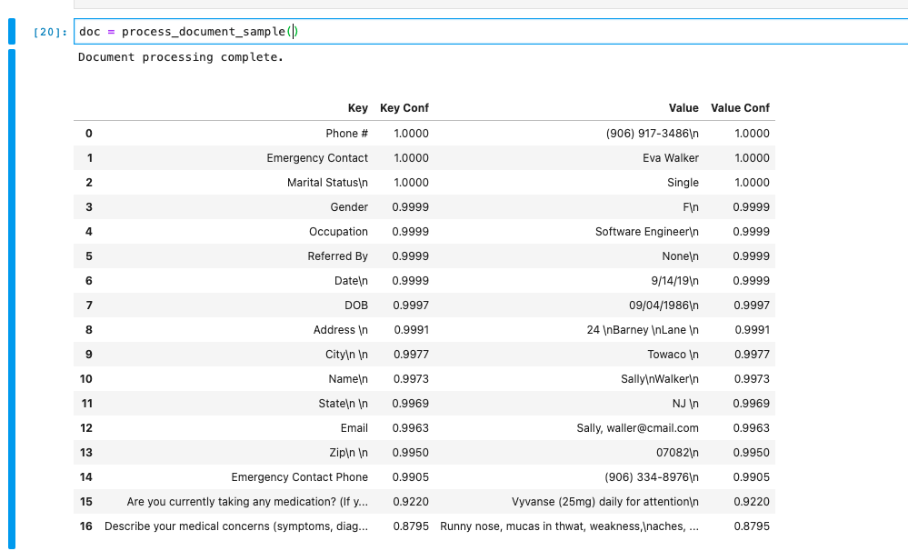

# Document AI Notebooks 

This repository contains several [Google AI Platform notebooks][notebooks] 
to be used with the Cloud [Document AI Platform][docai].



## Prerequisites 

You must be familar GCP and have your own project with billing enabled.

1. Set up your GCP project for Document AI following the [Setup Guide][set_up].
1. Enable the 'Document AI API' in your project in the Document AI [Platform][platform].
1. Create a Python 3 notebook in your GCP project and clone this repository.

## Instructions

1. Identify which form type or utility you would like to run through a processor.
2. Create your processor using the [instructions][create_processor].
3. Copy your processor id.

4. Find the cell where the processor variables are created, you will also need your GCP Project ID.

```
PROJECT_ID = "YOUR_PROJECT_ID_HERE"
LOCATION = "LOCATION"  # Format is 'us' or 'eu'
PROCESSOR_ID = "PROCESSOR_ID"  # Create processor in Cloud Console
```
Please note, the location must match the one assigned to the processor. 

5. Run the notebook. 

[notebooks]: https://cloud.google.com/ai-platform-notebooks
[docai]: https://cloud.google.com/document-ai/docs/
[set_up]: https://cloud.google.com/document-ai/docs/setup
[platform]: https://console.cloud.google.com/ai/document-ai
[create_processor]: https://cloud.google.com/document-ai/docs/create-processor
