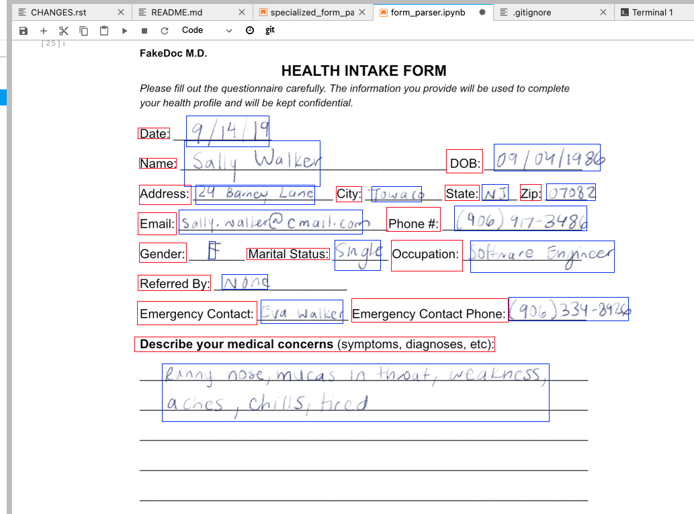
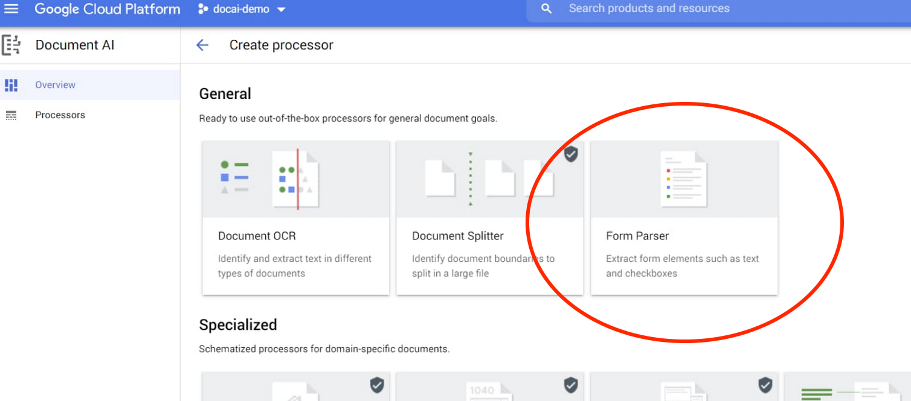
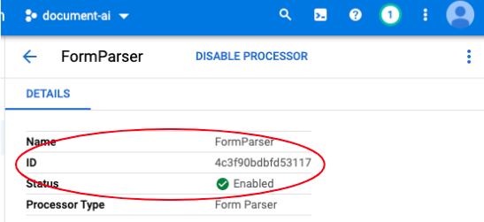

# Document AI Bouding Boxes Workshop 

In this tutorial you will process a document with a Document AI processor and
visualize its output.




## Prerequisites 

You must be familar GCP and have your own project created.

1. Set up your GCP project for Document AI following the [Setup Guide](https://cloud.google.com/document-ai/docs/setup)
1. Enable the 'Document AI API' in your project in the [Cloud Console](https://console.cloud.google.com/ai/document-ai)
1. Create a Python 3 AI Platform Notebook in your GCP project and clone this repository.

## Form Parser Tutorial

In this step we will use the Document AI Form Parser to parse a generic sample form.

1. Create a processor, follow the step [here](https://cloud.google.com/document-ai/docs/create-processor) 
to create an instance of a Form Parser.



2. Copy your processor id.



3. Find the cell where the processor variables are set, you will also need your GCP Project ID.

```
PROJECT_ID = "YOUR_PROJECT_ID_HERE"
LOCATION = "LOCATION"  # Format is 'us' or 'eu'
PROCESSOR_ID = "PROCESSOR_ID"  # Create processor in Cloud Console
```
Please note, the location must match the one assigned to the processor. 

4. Run the notebook. 
